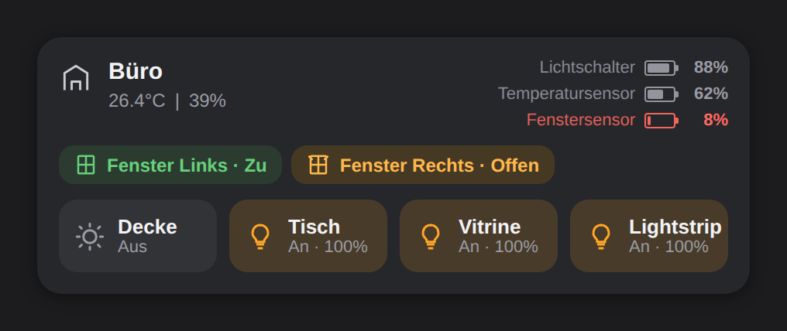
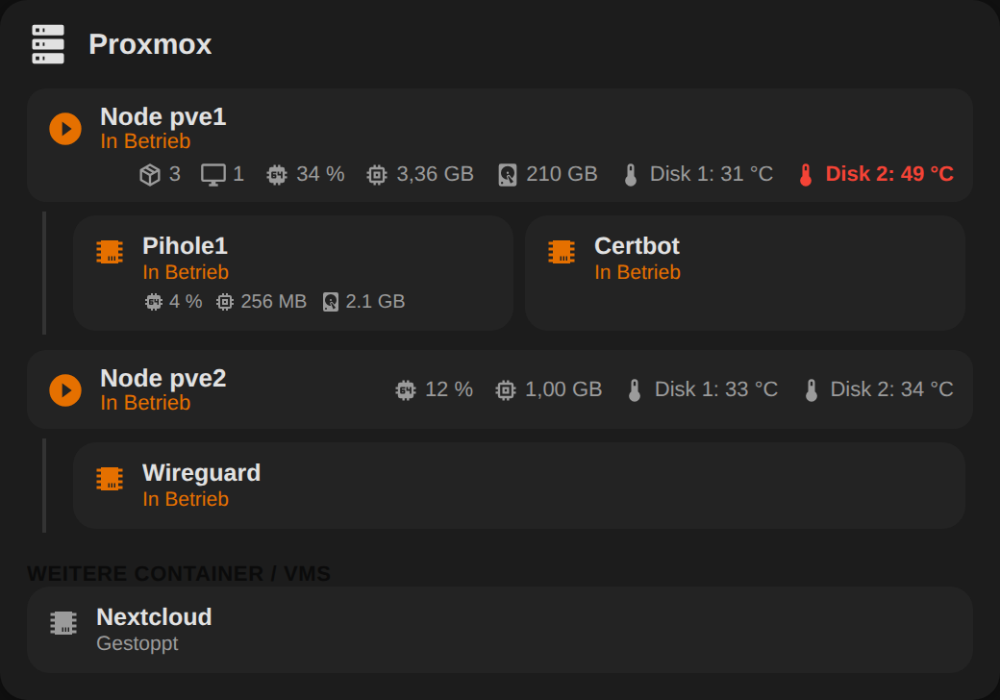
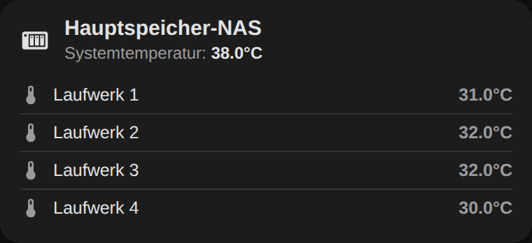

# HA SimCard

[](https://www.home-assistant.io)
[](https://github.com/hacs/integration)
[](LICENSE)



A compact, fully visually configurable **room overview card** for Home Assistant. Give it a
room name/icon, and only the things you actually have in that room — windows, doors, smoke
detectors, leak sensors, a temperature/humidity sensor, a switch battery, and up to 4 buttons
— show up. Nothing else.

> HA SimCard is an independent card, not an update to or dependency of any other room card —
> install it alongside other Lovelace cards without conflicts (own custom element name,
> own config schema). It's built around a single job: a clean, conditional per-room status
> card. Image backgrounds, climate-device integration, and cover/shutter position controls
> have been removed entirely — this card is not a general-purpose dashboard tile.

This repository also includes two standalone infrastructure cards — own custom element name,
own config schema, usable independently of HA SimCard and of each other:
**[HA Infra: Proxmox](#-ha-infra-proxmox)** (nodes + container/VM tiles) and
**[HA Infra: NAS](#-ha-infra-nas)** (one device's drive temperatures per card). All three ship
in the single `ha-simcard.js` file — one download, one Lovelace resource, no extra install
steps to get all three cards. (HACS's "plugin" category only auto-tracks one file per
repository, so bundling them together is what makes both new cards actually show up via
HACS instead of silently never being downloaded.)

---

## ✨ What it shows

* **Header** — room name + icon, with an optional temperature/humidity line underneath.
* **Stat gauges** (top-right, stacked) — small battery-style gauges for:
  * up to 4 **switch/remote batteries** (e.g. physical wall switches)
  * the **temperature/humidity sensor's battery**
  Each gauge only appears if you've configured that entity — nothing is shown by default.
* **Binary device chips** — one per configured device (1–10). Each is a window, door, smoke
  detector, or leak sensor — own icon, own state wording (Open/Closed, Smoke/OK, Wet/Dry),
  own configurable on/off color pair per type, and — if it has a battery sensor configured —
  a small battery gauge right-aligned in that same row, instead of a separate stat gauge up
  top.
* **Buttons** — up to 4 freely definable switches (lights, switches, fans, covers like garage
  doors), showing name + state (and light brightness %, if applicable).

Everything above is independently clickable: tap/hold actions are configurable per device,
per battery gauge, for temperature, for humidity, and for every button.

**Bonus:** any battery gauge turns red (configurable) once it drops to/below a threshold
(default 10%).

---

## 📥 Installation

### Via HACS
Add this repository as a custom repository in HACS (category: *Dashboard*/*Plugin*), then
install **HA SimCard**.

### Manual
1. Download `ha-simcard.js` from the repository.
2. Copy it to `/config/www/`.
3. Add a resource: URL `/local/ha-simcard.js` · Type: JavaScript Module.

---

## ⚙️ Configuration

Add the card via **"Add Card"** → **HA SimCard**. Everything is configurable in the
visual editor — no YAML required. Every section below only needs to be filled in if you
actually have that entity; anything left empty is simply not rendered on the card.

### Card level

| Option | Default | Description |
|---|---|---|
| `name` | — | Room name |
| `icon` | `mdi:home-outline` | Header icon |
| `collapsible` | `false` | Click the header to collapse/expand devices + buttons. Collapsed, the binary devices still show as a row of small icon-only chips |
| `default_state` | `expanded` | `expanded` · `collapsed` (only relevant when `collapsible: true`) |
| `remember_state` | `true` | Remember collapsed/expanded state across reloads |
| `window_open_color` / `window_closed_color` | `#FFA000` / `#4CAF50` | Chip color for `type: window` entries, open/closed |
| `door_open_color` / `door_closed_color` | `#FFA000` / `#4CAF50` | Chip color for `type: door` entries, open/closed |
| `smoke_open_color` / `smoke_closed_color` | `#f44336` / `#4CAF50` | Chip color for `type: smoke` entries, smoke/OK |
| `leak_open_color` / `leak_closed_color` | `#f44336` / `#4CAF50` | Chip color for `type: leak` entries, wet/dry |
| `battery_warning_threshold` | `10` | Battery gauges turn `battery_warning_color` at/below this % |
| `battery_warning_color` | `#f44336` | Warning color for low battery gauges |

### `windows` (list, 1–10 entries) — "Binary Devices" in the editor

| Option | Default | Description |
|---|---|---|
| `entity` | — | `binary_sensor` (or `sensor`) — window/door contact, smoke detector, or leak sensor |
| `type` | `window` | `window` · `door` · `smoke` · `leak` — switches the chip icon, its two state labels (Open/Closed, Smoke/OK, Wet/Dry), its color pair (see above), and the fallback label if `label` is empty |
| `label` | — | Custom label (falls back to friendly name) |
| `tap_action` / `hold_action` | — | Action on the chip |
| `battery_entity` | — | Optional battery sensor for this device — shown as a small gauge inline at the right edge of its chip |
| `battery_label` | — | Hover tooltip for that gauge (falls back to friendly name) |
| `battery_tap_action` / `battery_hold_action` | — | Action on that gauge |

### `climate` (single object, all optional)

| Option | Description |
|---|---|
| `temperature_entity` / `temperature_label` / `temperature_tap_action` / `temperature_hold_action` | Temperature sensor shown in the header subline |
| `humidity_entity` / `humidity_label` / `humidity_tap_action` / `humidity_hold_action` | Humidity sensor shown in the header subline |
| `battery_entity` / `battery_label` / `battery_tap_action` / `battery_hold_action` | Battery of the temperature/humidity sensor device — adds a stat gauge |

### `switch_batteries` (list, up to 4 entries)

One stat gauge per entry — for rooms with more than one physical switch/remote.

| Option | Description |
|---|---|
| `entity` | Battery sensor of a physical switch/remote in the room |
| `label` | Label for the gauge (e.g. "Lichtschalter") |
| `tap_action` / `hold_action` | Action on that gauge |

> The old single-object `switch_battery: {entity: ..., ...}` form still works if you have it
> in an existing config — it's read as a one-item list. The editor always writes the new
> `switch_batteries` list form.

### `controls` (list, up to 4 entries)

| Option | Default | Description |
|---|---|---|
| `entity` | — | `light` / `switch` / `fan` / `cover` entity |
| `name` | friendly name | Button label |
| `icon` | auto per domain/state | Icon override |
| `show_icon` | `true` | Show/hide the icon |
| `on_color` | `#ffa726` | Accent color used when the entity is on/active |
| `tap_action` | `toggle` | Tap action |
| `hold_action` | `more-info` | Hold action |
| `double_tap_action` | `none` | Double-tap action |

### Actions

Every `tap_action` / `hold_action` / `double_tap_action` accepts:
`more-info` (default) · `toggle` · `navigate` (+ `navigation_path`) ·
`call-service` (+ `service`, `service_data`) · `none`.

---

## Example YAML

```yaml
type: custom:ha-simcard
name: Gästezimmer
icon: mdi:home-outline
collapsible: true

windows:
  - entity: binary_sensor.gaestezimmer_fenster_nord
    label: Fenster Nord
  - entity: binary_sensor.gaestezimmer_fenster_ost
    label: Fenster Ost
    battery_entity: sensor.gaestezimmer_fenster_ost_batterie
    battery_label: Fensterbatterie Ost
  - entity: binary_sensor.gaestezimmer_rauchmelder
    type: smoke
    label: Rauchmelder

climate:
  temperature_entity: sensor.gaestezimmer_temperatur
  humidity_entity: sensor.gaestezimmer_luftfeuchtigkeit
  battery_entity: sensor.gaestezimmer_klimasensor_batterie
  battery_label: Klimasensor

switch_batteries:
  - entity: sensor.gaestezimmer_schalter_batterie
    label: Schalterbatterie
  - entity: sensor.gaestezimmer_nachttisch_schalter_batterie
    label: Schalter Nachttisch

controls:
  - entity: light.gaestezimmer_decke
    name: Decke
    tap_action: { action: toggle }
    hold_action: { action: more-info }
  - entity: light.gaestezimmer_bett
    name: Bett
  - entity: light.gaestezimmer_spiegel
    name: Spiegel
  - entity: light.gaestezimmer_kette
    name: Kette

battery_warning_threshold: 10
battery_warning_color: "#f44336"
smoke_open_color: "#f44336"
smoke_closed_color: "#4CAF50"
```

> The entity IDs above are made up for illustration — swap in your own `binary_sensor` /
> `sensor` / `light` (or `switch` / `fan` / `cover`) entities.

---

## 🖥️ HA Infra: Proxmox



A compact Proxmox overview card: one row per node (status, running containers/VMs, CPU, RAM,
storage, and per-disk temperatures) with that node's container/VM tiles — each showing its
own CPU/RAM/storage — grouped directly underneath it. Containers/VMs not assigned to any
node show in a flat section at the end (and if you don't assign any container to a node at
all, the card looks exactly like a single flat grid — the grouping is opt-in per container).

### Installation

No separate install step — it's part of `ha-simcard.js` (see [Installation](#-installation)
above). If you already have HA SimCard's resource added, just add the card via
**"Add Card"** → **HA Infra: Proxmox**.

### Configuration

#### Card level

| Option | Default | Description |
|---|---|---|
| `name` | — | Card title |
| `icon` | `mdi:server` | Header icon |
| `running_color` | `#E57000` | Status icon / tile color when running |
| `stopped_color` | `#9b9b9b` | Status icon / tile color when stopped |
| `temperature_warning_threshold` | `45` | Disk/node temperatures at/above this value turn red |
| `temperature_warning_color` | `#f44336` | That warning color |

#### `nodes` (list, up to 10 entries)

| Option | Description |
|---|---|
| `name` | Node label (falls back to friendly name) |
| `status_entity` | `binary_sensor` (or `sensor`) — on/`running` = node up |
| `containers_entity` | Optional `sensor` — running container count |
| `vms_entity` | Optional `sensor` — running VM count |
| `cpu_entity` | Optional `sensor` — node CPU usage |
| `memory_entity` | Optional `sensor` — RAM/free memory (shown with its own unit) |
| `storage_entity` | Optional `sensor` — node storage usage |
| `temperature_entity` | Optional `sensor` — a single node-level temperature, if your setup exposes one |
| `drives` (list, up to 4) | Per-disk temperature sensors — each entry is `entity` (`sensor`) + `label` (e.g. "Disk 1"). Most Proxmox setups don't expose a node temperature via Home Assistant at all; this is the practical alternative — point it at your SMART/disk-temperature sensors instead. Colored via the card-level warning threshold, same as the NAS card. |
| `tap_action` / `hold_action` | Action on the node row |

#### `containers` (list, up to 20 entries) — container/VM tiles

| Option | Default | Description |
|---|---|---|
| `entity` | — | `switch` / `binary_sensor` / `sensor` |
| `name` | friendly name | Tile label |
| `icon` | `mdi:chip` | Icon override |
| `show_icon` | `true` | Show/hide the icon |
| `node_id` (editor: a dropdown of your configured nodes) | ungrouped | Which node this container/VM renders under (matches a node's internal `id`). Leave unset to keep it in the flat, ungrouped section. |
| `cpu_entity` | — | Optional `sensor` — this container/VM's CPU usage |
| `ram_entity` | — | Optional `sensor` — this container/VM's RAM usage |
| `storage_entity` | — | Optional `sensor` — this container/VM's storage usage |
| `tap_action` | `toggle` | Tap action |
| `hold_action` | `more-info` | Hold action |
| `double_tap_action` | `none` | Double-tap action |

Actions accept the same `more-info` · `toggle` · `navigate` · `call-service` · `none` as HA
SimCard.

> The editor's node dropdown references nodes by a stable internal ID, not by name — assigned
> containers stay correctly grouped even if you rename a node afterward. Deleting a node
> un-assigns (doesn't delete) any containers that pointed at it; they fall back to the
> ungrouped section instead of disappearing.

### Example YAML

```yaml
type: custom:ha-infra-proxmox
name: Proxmox
icon: mdi:server

nodes:
  - id: node_pve1
    name: Node pve1
    status_entity: binary_sensor.pve1_status
    containers_entity: sensor.pve1_containers_running
    vms_entity: sensor.pve1_vms_running
    cpu_entity: sensor.pve1_cpu_usage
    memory_entity: sensor.pve1_memory_free
    storage_entity: sensor.pve1_storage_used
    drives:
      - entity: sensor.pve1_disk1_temperature
        label: Disk 1
      - entity: sensor.pve1_disk2_temperature
        label: Disk 2
  - id: node_pve2
    name: Node pve2
    status_entity: binary_sensor.pve2_status
    cpu_entity: sensor.pve2_cpu_usage
    memory_entity: sensor.pve2_memory_free

containers:
  - entity: switch.pihole1
    name: Pihole1
    node_id: node_pve1
    cpu_entity: sensor.pihole1_cpu
    ram_entity: sensor.pihole1_ram
    storage_entity: sensor.pihole1_storage
  - entity: switch.certbot
    name: Certbot
    node_id: node_pve1
  - entity: switch.nextcloud
    name: Nextcloud

temperature_warning_threshold: 45
temperature_warning_color: "#f44336"
```

> Not built for per-stat drill-down: tapping a node row targets its `status_entity` only, not
> the individual container/VM/CPU/RAM/storage/disk sensors next to it. Same for container/VM
> tiles — the tap/hold/double-tap actions target the tile's own `entity`.

---

## 💾 HA Infra: NAS



A compact NAS overview card: one device per card instance (matching HA SimCard's one-room-
per-card approach) — system temperature in the header, drive temperatures listed below.
Any drive at/above the warning threshold turns red.

### Installation

No separate install step — it's part of `ha-simcard.js` (see [Installation](#-installation)
above). If you already have HA SimCard's resource added, just add the card via
**"Add Card"** → **HA Infra: NAS**.

### Configuration

#### Card level

| Option | Default | Description |
|---|---|---|
| `name` | — | Device name |
| `icon` | `mdi:nas` | Header icon |
| `system_temperature_entity` | — | Optional `sensor` shown in the header |
| `system_temperature_label` | — | Label override |
| `system_temperature_tap_action` / `_hold_action` | — | Action on the header temperature |
| `temperature_warning_threshold` | `45` | Drives at/above this value turn red |
| `temperature_warning_color` | `#f44336` | That warning color |

#### `drives` (list, up to 12 entries)

| Option | Description |
|---|---|
| `entity` | `sensor` — drive temperature |
| `label` | Row label (falls back to friendly name) |
| `tap_action` / `hold_action` | Action on that row |

### Example YAML

```yaml
type: custom:ha-infra-nas
name: Hauptspeicher-NAS
icon: mdi:nas
system_temperature_entity: sensor.nas1_temperature

drives:
  - entity: sensor.nas1_drive1_temperature
    label: Laufwerk 1
  - entity: sensor.nas1_drive2_temperature
    label: Laufwerk 2
  - entity: sensor.nas1_drive3_temperature
    label: Laufwerk 3
  - entity: sensor.nas1_drive4_temperature
    label: Laufwerk 4

temperature_warning_threshold: 45
temperature_warning_color: "#f44336"
```

> More than one NAS? Add one card instance per device, same as HA SimCard's per-room cards.

---

## 📋 Changelog

See [CHANGELOG.md](CHANGELOG.md).
